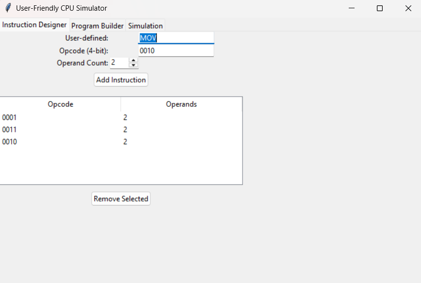
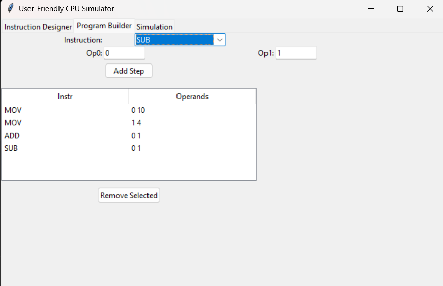
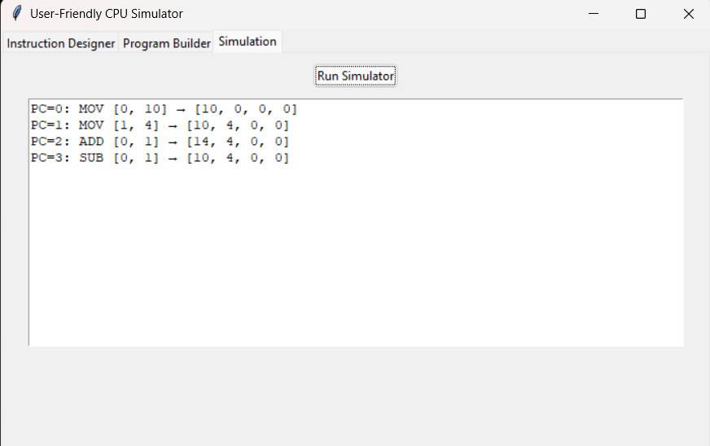

# Custom CPU Simulator with User-Defined Instruction Set Architecture

## Team Members

* Aakash V (192511001)
* Deepak R (192511008)

## My Contributions (Deepak R)

I was responsible for the development and implementation of **Module 2 – Simulator Engine**.

### Key Contributions

* Developed the CPU execution engine responsible for instruction processing.
* Implemented register-based execution and state management.
* Designed Program Counter (PC) tracking and execution flow control.
* Developed arithmetic and logical instruction execution modules.
* Implemented execution trace generation for program analysis.
* Assisted in integration of the simulation engine with the graphical user interface.
* Participated in testing, debugging, and performance validation.

## Technologies Used

* Python
* Tkinter
* Object-Oriented Programming (OOP)

## Features

* User-Defined Instruction Set Architecture (ISA)
* Custom Opcode Design
* Instruction Set Designer
* Program Builder Interface
* Register-Based CPU Simulation
* Program Counter Tracking
* Arithmetic and Logical Operations
* Execution Trace Generation
* Interactive Graphical User Interface

## Project Overview

The Custom CPU Simulator is an educational CPU simulation platform that allows users to create custom instruction sets, design executable programs, and observe CPU execution at the register level. The simulator demonstrates key Computer Architecture concepts including instruction encoding, opcode design, execution flow, and register manipulation through an intuitive graphical interface.

## Screenshots

### Instruction Designer



### Program Builder



### Simulation Output



## How to Run

1. Install Python 3.8 or above.

2. Run the application:

```bash
python custom_cpu_simulator.py
```

## Applications

* Computer Architecture Education
* Instruction Set Architecture Learning
* CPU Design Fundamentals
* Academic Demonstrations
* Processor Simulation

## Future Enhancements

* Pipeline Execution Support
* Cache Memory Simulation
* Branch Prediction
* Interrupt Handling
* Multi-Core Processor Simulation
* Memory Management Visualization

## Project Documentation

* Project_Report.pdf
* Custom_CPU_Simulator_Presentation.pptx
